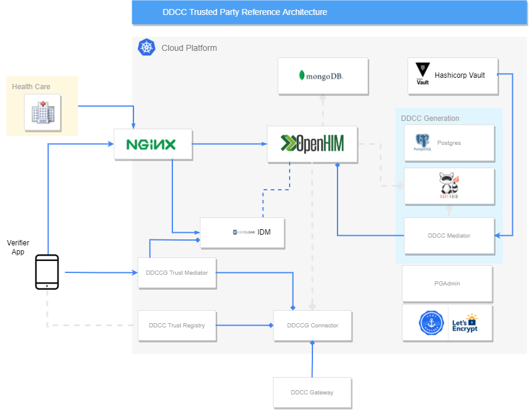

# Trusted Party Reference Implementation

## Introduction

This project shall give an best practise overview how an trusted party backend could be implemented to adapt the DDCC in the local infrastructure. All content is only for testing and study purposes and should not be copied 1:1 to production before appropiate technical,security and data privacy audits according to the local regulations and legal aspects/ needs. 

## Overview

  

## Kubernetes

The cluster can be set up in any kubernetes environment like k8s, k3s or [others](https://kubernetes.io/de/docs/setup/). From platform to platform can be deriviations which must be considered during the adaptation e.g. with the available ingress controllers, api gateways etc. The demo cluster remarks can be found in this [Readme](https://github.com/WorldHealthOrganization/ddcc-trusted-party-reference-implementation/blob/master/kubernetes/README.md)

In some environments, parts of the solution are already managed available. For instance managed postgres or managed mongoDB. If this is the case, the managed components should be prefered instead of operating dockerized components. A lot of vendors offering as well managed kubernetes platforms or PaaS systems which can cover already the most items which are necessary. 

Whatever is used, it must be well considered if the issuing of covid certificates and the handling of medical data is truthworthy and secure on the choosen platform. 

## Security Considerations

When the cluster is up and running, it must be ensured that security relevant things are not accessible for unauthorized persons from outside. Each endpoint which must be exposed to public, should be evaluated carefully for the security needs. For instance all certificate generation endpoints or management endpoints of the system, should be protected either by client certificates or other appropiate protection mechanisms. How to grant people/issuers the rights to use this endpoints depends on the local regulations, processes and health care structures. Whatever issuing process is used, the usage of those endpoints should be monitored and audited to detect fraud and misuse early. 

Within the cluster, the most important point is to protect the private key material for signing certificates (internal employees included). The amount of people with access to the siging infrastructure must be limited. It's recommended to split the signing/key material components out in a seperate environments to realize an organizational split. For instance in different accounts, different data centers or similiar. Need to know principles should also be respected for internal technical details or structures. 

If possible, all components used in the cluster should be seperated in different namespaces with additional security hardening in MicroVMs(e.g. [Kata](https://katacontainers.io)), Special Container Hardening (e.g. [Scone](https://scontain.com/index.html?lang=en)) or similiar. Not each of that techniques may be compatible with your local environment, because some of them require maybe special hardware as TPM modules or Intel SGX supporting Processors.

Check in every case the default [security advices](https://kubernetes.io/docs/tasks/administer-cluster/securing-a-cluster/).

Further security advices are collected [here](https://github.com/WorldHealthOrganization/ddcc-trusted-party-reference-implementation/blob/master/docs/SECURITYGUIDE.md).

## Main Components

### Keycloak

The [keycloak](https://github.com/keycloak/keycloak) component is a widely used IAM system within open source solutions. It's in this solution used to provide user and client management functionalities. 

A installation guide can be found [here](https://github.com/WorldHealthOrganization/ddcc-trusted-party-reference-implementation/blob/master/docs/KEYCLOAK.md).

### Hashicorp Vault

The [hashicorp vault](https://github.com/hashicorp/vault) component was introduced to fullfill the following tasks: 

- Provision of a secret store which can be operational decoupled from the plattform operator
- Provision of a [secure encryption/signing engine](https://learn.hashicorp.com/tutorials/vault/eaas-transit) which can be potentially enhanced by an [HSM](https://www.vaultproject.io/docs/enterprise/hsm)
- Provision of a basic [PKI](https://learn.hashicorp.com/tutorials/vault/pki-engine) for creating and storing certificates

In a future version, the vault can also be enhanced by [plugins](https://www.vaultproject.io/docs/internals/plugins) to support new crypto algorithms or signing procedures which are not immediately supported by HSMs.

A installation guide can be found [here](https://github.com/WorldHealthOrganization/ddcc-trusted-party-reference-implementation/blob/master/docs/HASHICORPVAULT.md).

### Matchbox Server

This component is used within the transaction mediator to generate DDCC. More information can be found [here](https://github.com/ahdis/matchbox)

More about the installation can be found in the [docs](https://github.com/WorldHealthOrganization/ddcc-trusted-party-reference-implementation/blob/master/docs/MATCHBOX.md) section.

### HAPI FHIR

The [HAPI FHIR](https://hapifhir.io) server is a standard component following the HL7 FHIR standard for healthcare interoperability.

More about the installation can be found in the [docs](https://github.com/WorldHealthOrganization/ddcc-trusted-party-reference-implementation/blob/master/docs/HAPIFHIR.md) section.

### OpenHIM

[OpenHIM](http://openhim.org) is a middleware which shall simplify the interoperability and orchestration between disparate information systems. The components supports the dynamic registration of mediators (e.g. Transaction Mediator) or the introduction of cron jobs to handle tasks. For creating a mediator the mediator tools from [this](http://openhim.org/mediator-library) side is a good start. 

More about the installation can be found in the [docs](https://github.com/WorldHealthOrganization/ddcc-trusted-party-reference-implementation/blob/master/docs/OPENHIM.md) section.

### DDCC Transactions Mediator

This [mediator](https://github.com/WorldHealthOrganization/ddcc-transactions-mediator) is an add on to OpenHIM/FHIR for generating the DDCCs. 

### Postgres

Postgres was introduced to provide an standard open source database for the components. The database must be installed according to the used platform (either managed or self hosted). High Availability and Backup Strategies must be choosen according the local policies and regulations.

### Mongo DB

MongoDB is used by OpenHIM to store the data about users and transactions. The mongodb setup must be choosen according the local policies and regulations. Mongo DB offers the possibility to scale out the database by more secondaries or shards. Which setup is the ideal one, depends on the OpenHim Load and availability needs. The usage of MongoDB Replica Sets is a good choice for read scale outs and should be used if the read performance must be increased. For very big datasets and write operations the sharding operations mode should be considered. 

### CertManager

The certmanager provides the functionality to request automatically let's encrypt certificates for [TLS hosts](https://github.com/WorldHealthOrganization/ddcc-trusted-party-reference-implementation/tree/master/kubernetes#cert-manager). All certificates are domain validated and generated by adding the annotations to the ingress rules. How to install, is described [here](https://github.com/WorldHealthOrganization/ddcc-trusted-party-reference-implementation/blob/master/docs/CERTMANAGER.md)

## Out of Scope

The demo cluster contains currently no monitoring or auditing toolstack, because each platform provides normally it's own stack. 

